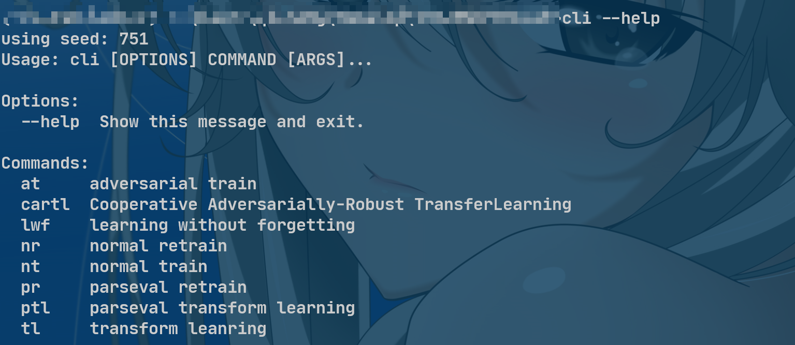

### introduction 

​	the repository is for the work **`CARTL: Cooperative Adversarially-Robust Transfer Learning`**

​	our code is recognized as follows:

​	

- the networks directory stores code for neural networks
- the trainer directory stores code for training
  - you can choose training parameters according to our comments and our paper
- the utils directory stores code for some useful functions, such as load dataset

### how to use

1. create and activate a new virtual environment

2. download prerequisite libraries using following code

   ```bash
   pip install -r requirements.txt
   pip install --editable .
   ```

3. create empty directories named `trained_models`、`checkpoint`、`logs`

4. set hyperparameters in `src/config.py`

5. use `cli --help` to see training options

   

