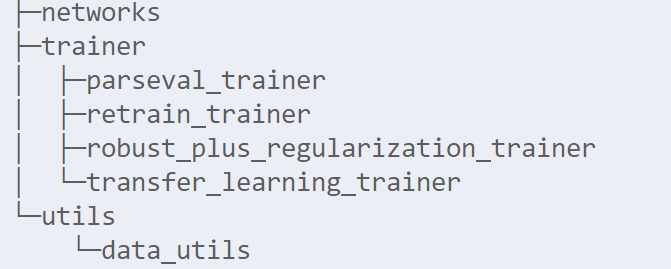

### introduction 

​	the repository is for the work **`CARTL: Cooperative Adversarially-Robust Transfer Learning`**

​	our code is recognized as follows:

​	

- the networks directory stores code for neural networks
- the trainer directory stores code for training
  - you can choose training parameters according to our comments and our paper
- the utils directory stores code for some useful functions, such as load dataset

### how to use

1. create and activate a new virtual environment

2. download prerequisite libraries using following code

   ```bash
   pip install -r requirements.txt
   ```

3. set hyperparameters in `src/config.py`

4. set training parameters in `src/train.py` according to our examples

5. start training

   ```bash
   python -m src.train
   ```

6. test robustness

   ```bash
   python -m src.attack
   ```

